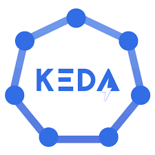

# Scaling Kubernetes apps with KEDA
Some workloads experience high variations in load and usage. Here we'll take a closer look on how you can autoscale your Kubernetes apps by using KEDA.



## Cloud-native autoscaling with KEDA
Scaling apps and workloads is not a new phenomena for software engineers. Some may experience that their apps has high usage surges (Ticketmaster anyone). Others have workers and jobs with varying throughput because of their business-logic. 

As more and more workloads run in Kubernetes, many software engineers has probably appreciated how easy it is to scale workloads in Kubernetes using the built-in `Horizontal Pod Autoscaler`. The HPA allow you to automatically scale the number of pods your app are running based on resource metrics such CPU and memory usage. This works fine for some scenarios, but in other cases the autoscaling should optimally be more proactive. 

Kubernetes Event-driven Autoscaling (KEDA) extends the capabilities of the HPA and allows software engineers to scale workloads on external metrics, such as number of messages in a queue, files in a blob storage, Elasticsearch queries and many more, in a simple and cloud-native way. As the name implies, it fits well with workloads running in an event-driven architecture. 

At Intility, we have successfully implemented KEDA to autoscale our [Mobile Operator Data Platform](https://engineering.intility.com/article/why-we-chose-to-build-our-own-data-platform-in-an-archaic-landscape). KEDA delivers on its promise, but there are several implications one should consider before implementing it in production. More on that in our summary. 

This article will show how you install and use KEDA to autoscale an app receiving messages from a Service Bus Queue. As Kubernetes is complex, we will use some time setting up our local environment and explaining what's going on. If you prefer the quick and dirty to get it up and running, please visit the [Github repository](https://github.com/daniwk/app-scaling-keda).

[insert sketch of what we are trying to do]

# Prequisites
Okay. The list of prerequisites below is _a lot_. Each tool is not strictly necessary either, but they will allow you to use more time on fun stuff, like testing KEDA, and less time on time-consuming stuff, like "how do you setup a built-in registry in my cluster again?".
- 📦 `kind`. Running local k8s cluster.
- 🐳 `Docker`. Running kind and building container images.
- 🐄 `ctlptl`. CLI for declarative setup of k8s cluster.
- ⌨️ `kubectl`. CLI to interact with k8s cluster.
- 🧑‍💻 `k9s`. User-friendly interface to k8s cluster.
- 🛠️ `Tilt`. Toolkit to simplify local development of cloud-native apps.
- 📨 Access to `Azure` account to setup and use Service Bus.

## Clone the GitHub repository
Clone the GitHub repository and navigate to the folder `git clone git@github.com:daniwk/app-scaling-keda.git && cd app-scaling-keda/`

## Create your local Kubernetes cluster
To install KEDA you will need to have access to a k8s cluster with cluster-admin privileges, either locally or a hosted deployment. In this article we'll use [kind](https://kind.sigs.k8s.io/docs/user/quick-start/) to create a local cluster. Additionally, we'll use [ctlptl]() to configure the cluster declaratively and create it with a built-in container registry.  

1. Install kind: `brew install kind`. See [docs](https://kind.sigs.k8s.io/docs/user/quick-start/#installation) for other install methods.
2. Install [docker](https://www.docker.com/products/docker-desktop/).
3. Install ctlptl: `brew install tilt-dev/tap/ctlptl`
3. Create a Kubernetes cluster: `ctlptl apply -f deploy/k8s/kind.yaml`
4. Install kubectl: `brew install kubectl`. See [docs](https://kubernetes.io/docs/tasks/tools/install-kubectl-macos/) for other install methods.

[Screenshot of successfully created cluster]

## (Optional) View and manage cluster with k9s
`k9s` offers a bit more user-friendly interface than the standard `kubectl` CLI to your Kubernetes cluster.
- Install k9s: `brew install derailed/k9s/k9s`
- Connect to your newly created cluster: `k9s`

[screenshot of successfully connected cluster]

## Tilt
Tilt deserves a blog post in its own. It's a toolkit which greatly improves the local development of Kubernetes apps. It provides a tight feedback loop by automatically building your Dockerfile and deploying it to your local k8s cluster live with every code edit. We'll use it here to skip the docker build and push process. 
- Install it by: `curl -fsSL https://raw.githubusercontent.com/tilt-dev/tilt/master/scripts/install.sh | bash`

## Provision Service Bus Namespace, Queue and Topic Subscription
Log into your Azure account. If you don't have any, sign up to a free subscription [here](https://azure.microsoft.com/en-us/free/). 

Use the Azure Cloud Shell or AZ CLI to get going:
1. Create resource group: `az group create --name rg-autoscale-dev --location norwayeast`
2. Randomize Service Bus namespace name: `namespaceName=MyNameSpace$RANDOM`
3. Create Service Bus namespace by using the AZ CLI in the cloud shell: `az servicebus namespace create --resource-group rg-autoscale-dev --name $namespaceName --location norwayeast`
4. Create Service Bus Queue: `az servicebus queue create --resource-group rg-autoscale-dev --namespace-name $namespaceName --name autoscalequeue`
6. Get the connection string to the Service Bus Namespace: `az servicebus namespace authorization-rule keys list --resource-group rg-autoscale-dev --namespace-name $namespaceName --name RootManageSharedAccessKey --query primaryConnectionString --output tsv`
7. Switch to your local terminal and save the output from the Cloud Shell in a file by running: `echo -n '<OUTPUT_FROM_CLOUD_SHELL>' > ./deploy/app/sb_connection_string.txt` in the cloned project directory.

# Use KEDA to autoscale an app based on Azure Service Bus Topic
Now that our local environment is up and running, we are ready to deploy our demo app and use KEDA to autoscale it. The demo app consists of:
- `app/receiver.py`: responsible to receive messages from the Azure Service Bus Queue and handle them. It's written to simulate a business logic where each message take some time to handle and we therefore need to scale the app out horizontally. Will be deployed to our local k8s cluster as a Deployment (see `deploy/app/receiver.yaml`).

```python
async def main():
    while True:
        print('Fetching messages.')
        lock_renewal = AutoLockRenewer()
        metro_client: ServiceBusClient
        async with ServiceBusClient.from_connection_string(
                conn_str=CONNECTION_STR,
                transport_type=TransportType.AmqpOverWebsocket
        ) as metro_client:

            receiver: ServiceBusReceiver
            async with metro_client.get_queue_receiver(
                    queue_name=QUEUE_NAME,
                    auto_lock_renewer=AutoLockRenewer(max_lock_renewal_duration=120),
                    max_message_count=1
            ) as receiver:
                async for message in receiver:
                    lock_renewal.register(receiver, message, max_lock_renewal_duration=60)
                    time.sleep(5)
                    await receiver.complete_message(message)
                    print("Handled message: " + str(message))

asyncio.run(main())
```
- `app/sender.py`: simple script to produce and send Service Bus Queue messages. Will be deployed to our local k8s cluster as a Job (see `deploy/app/sender.yaml`).

```python
async def main():
    service_bus_messages: List[Dict] = []
    for i in range(NR_MESSAGES):
        message = {"foo": "bar", "id": i}
        service_bus_messages.append(message)
    await send_queue_messages(queue_name=QUEUE_NAME, messages=service_bus_messages)

asyncio.run(main())
```
- necessary k8s config to run the app (namespace, configmap and secret)

## 1. Deploy the demo app
To deploy the demo app you simply run `tilt up` from the root of the directory. Press `space` and you will be sent to the Tilt UI which shows the resources being provisioned. You can also view the logs from the sender app by selecting `sq-queue-sender` and the subsequent logs from the receiver app by selecting the `sb-queue-receiver`.

[Screenshot/gif]

You can also view your resources by using `k9s`. You can use the following commands to view your resource
- View pods in namespace: `:namespace` and selecting `autoscale-demo`.
- View deployments: `:deploy`
- View jobs: `:job`
- View logs from a resource: select relevant resource and press `l`

[screenshot]

## 2. Use KEDA to scale our app
Put simply, KEDA scales apps by monitoring an external source and feed those metrics in to the [Horizontal Pod Autoscaler and its custom metric capability](https://kubernetes.io/docs/tasks/run-application/horizontal-pod-autoscale/#scaling-on-custom-metrics). Thus, KEDA extends existing functionality in Kubernetes, Like other Kubernetes tools also does. 

Specifically, we will:
1. Install KEDA in our cluster which will provide functionality for monitoring external source and ready-made integrations with Azure Service Bus Queues.
2. Create a `ScaledObject`, a KEDA primitive, which will provide connection details to our Azure Service Bus Queue. More importantly, it will create and manage the HPA which will handle the actual scaling of our receiver app. The `ScaledObject` will help us scale our app down to zero pods when the message queue is empty and scale out our app as more message arrives in our queue.

[draw.io on how KEDA works]

### Install KEDA
Install KEDA by running `kubectl kustomize deploy/keda --enable-helm | kubectl apply -f -`.

### Create ScaledObject to scale receiver app
The ScaledObject is defined in `deploy/autoscale/scaledobject.yaml`:

```yaml
apiVersion: keda.sh/v1alpha1
kind: ScaledObject
metadata:
  name: sb-queue-receiver-scaler
  namespace: autoscale-demo
spec:
  scaleTargetRef:
    apiVersion:    apps/v1 # Optional. Default: apps/v1
    kind:          Deployment       # Optional. Default: Deployment
    name:          sb-queue-receiver        # Mandatory. Must be in the same namespace as the ScaledObject
    # envSourceContainerName: new-cdr-poller-costusage-dev        # Optional. Default: .spec.template.spec.containers[0]
  pollingInterval:  15                               # Optional. Default: 30 seconds
  cooldownPeriod:   30                              # Optional. Default: 300 seconds
  idleReplicaCount: 0                                # Optional. Default: ignored, must be less than minReplicaCount 
  minReplicaCount:  0                                # Optional. Default: 0
  maxReplicaCount:  50                              # Optional. Default: 100
  fallback:                                          # Optional. Section to specify fallback options
    failureThreshold: 3                              # Mandatory if fallback section is included
    replicas: 6                                      # Mandatory if fallback section is included
  advanced:                                          # Optional. Section to specify advanced options
    restoreToOriginalReplicaCount: true       # Optional. Default: false
    # horizontalPodAutoscalerConfig:                   # Optional. Section to specify HPA related options
    #   name: cdr-poller-costusage-dev                   # Optional. Default: keda-hpa-{scaled-object-name}
    #   behavior:                                      # Optional. Use to modify HPA's scaling behavior
    #     scaleDown:
    #       stabilizationWindowSeconds: 300
    #       policies:
    #       - type: Percent
    #         value: 100
    #         periodSeconds: 15
  triggers: # {list of triggers to create jobs}
  - type: azure-servicebus
    metadata:
      # Required: queueName OR topicName and subscriptionName
      queueName: autoscalequeue
      # Optional, required when pod identity is used
      namespace: MyNameSpace5352 # Change this 
      # Optional, can use TriggerAuthentication as well
      connectionFromEnv: sb_connection_string.txt # This must be a connection string for a queue itself, and not a namespace level (e.g. RootAccessPolicy) connection string [#215](https://github.com/kedacore/keda/issues/215)
      # Optional
      messageCount: "1" # Optional. Count of messages to trigger scaling on. Default: 5 messages
      activationMessageCount: "1"

```

Deploy it by running the following command: `kubectl apply -f deploy/autoscale/scaledobject.yaml`. To view this resource in k9s simply type `:scaledobject`.

[screenshot]

## Play around with it
1. Change number of messages produces by sender app by editing the `NR_MESSAGES` parameter in `deploy/app/configmap.yaml`
2. Run the sender job again by pressing the `trigger update` button next to sq-queue-sender in Tilt UI.
3. Use `k9s` to watch KEDA scale out the receiver app (find `sb-queue-receiver` under deployments by using `:deploy` and watch the READY column).

[screenshot/gif]

## Clean up resources
1. Delete Kind
2. Delete Azure resource group

## Learnings
- keda is working well
- idempotency, optimize own code
- deployments vs jobs
- limits and request are integral
- plan ahead with your platform team

# Resources
- [Horizontal Pod Autoscaling, Kubernetes doc](https://kubernetes.io/docs/tasks/run-application/horizontal-pod-autoscale/#how-does-a-horizontalpodautoscaler-work)
- [KEDA docs](https://keda.sh/docs/2.9/)
- [Azure Service Bus docs](https://keda.sh/)
- [GitHub](https://github.com/daniwk/app-scaling-keda)
- [Tilt](https://tilt.dev/)